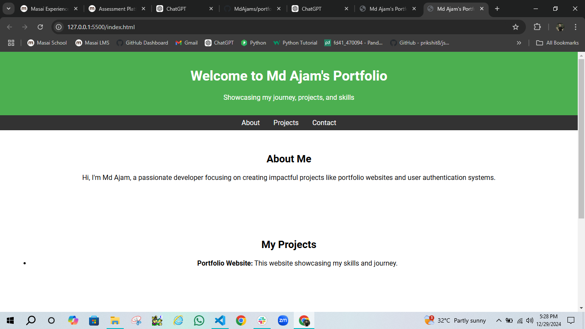

# Portfolio Site
## Description
This is a portfolio website showcasing my skills, projects, and professional journey.
## Installation

1. Clone the repository:
   ```bash
   git clone https://github.com/your-username/portfolio-site.git
   ```
2. Navigate to the project directory:
   ```bash
   cd portfolio-site
   ```
3. Open the project in a text editor or directly in your browser for preview:
   - If using Visual Studio Code:
     ```bash
     code .
     ```
## Usage

Open the `index.html` file in your browser to view the portfolio site.

### Example


 
 ## Contributing

Contributions are welcome! Follow these steps to contribute:
1. Fork the repository.
2. Create a new branch:
   ```bash
   git checkout -b feature-branch-name
   ```
3. Commit your changes:
   ```bash
   git commit -m "Add a meaningful message"
   ```
4. Push to the branch:
   ```bash
   git push origin feature-branch-name
   ```
5. Open a Pull Request.

## License

This project is licensed under the MIT License.
